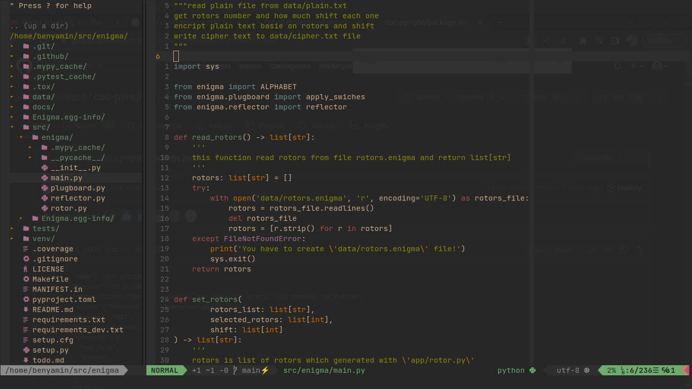

# neovim config

## installation
1. install <a href="https://github.com/junegunn/vim-plug">vim plug</a>
2. clone this repo into your ~/.config/nvim/
3. install <a href="https://github.com/neoclide/coc.nvim" >coc</a> on your system
4. install vim plugins with :PlugInstall
